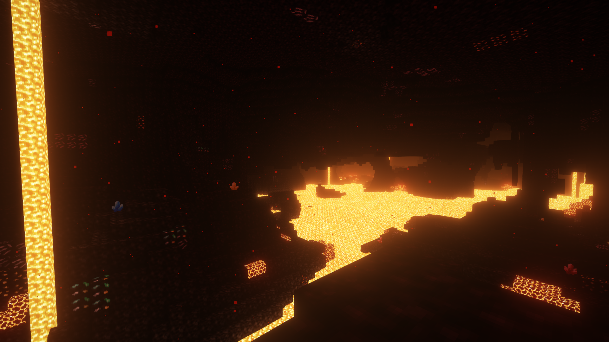
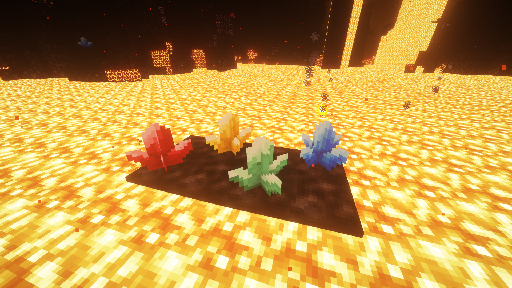
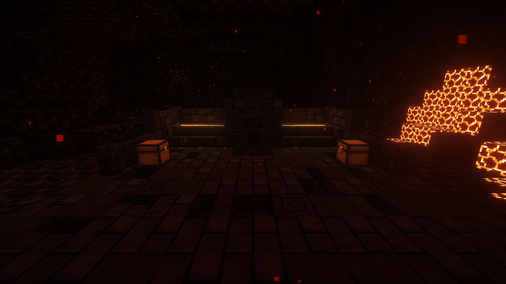
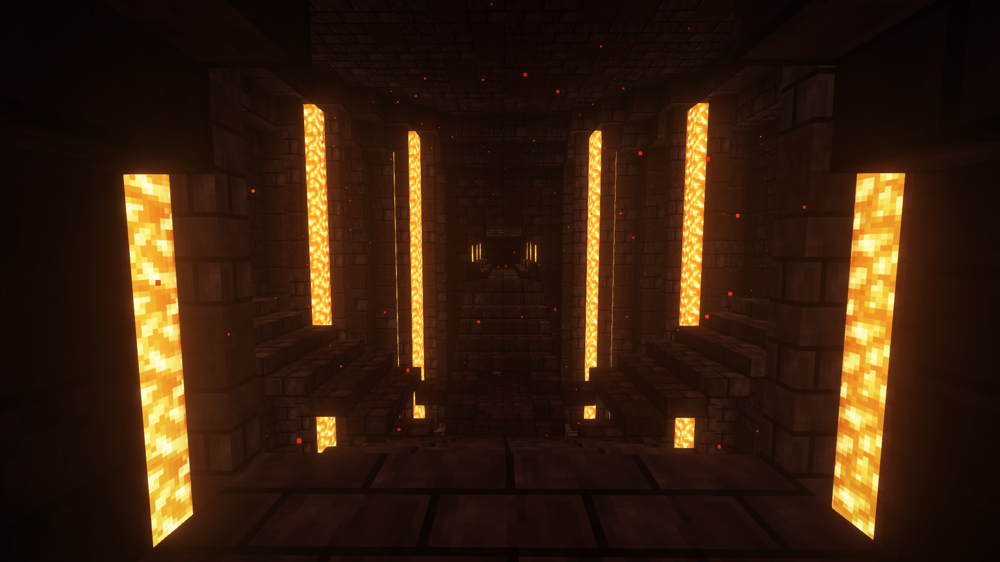
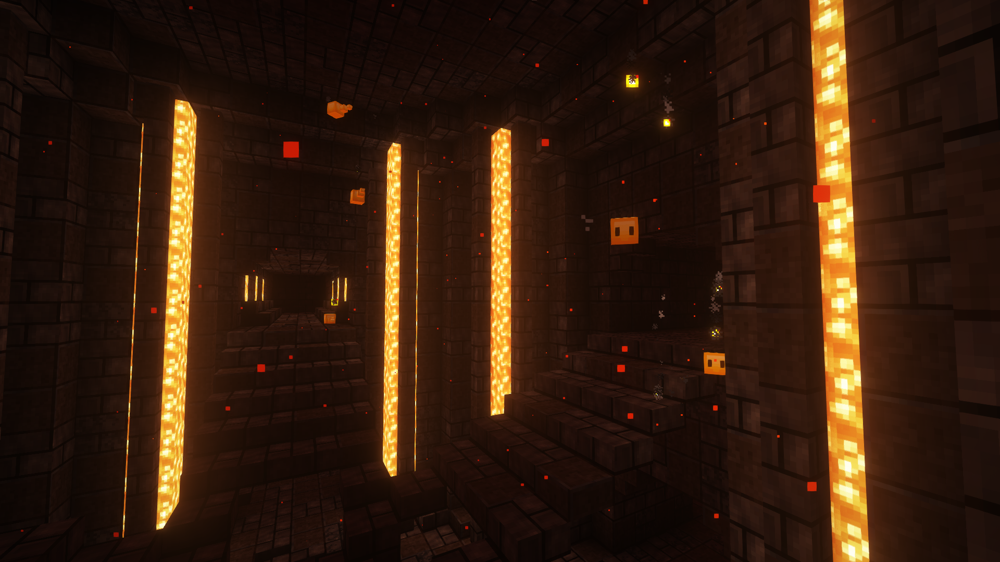

# Nether Depths Mod
The Nether Depths Mod is a Minecraft Mod that expands exploration within the Nether. It extends the Nether downwards to y = -64, filling the majority of the new space with a new biome: the Nether Depths.

## Nether Depths Biome
The Nether Depths is a new, dark biome that generates below y = 0 in the Nether. This is where you will find all of the new resources that this mod introduces.

Be careful! The heat here is so immense that one will not survive long! You will need some form of protection - either fire resistance, or the new Flame Guard enchantment.

## Gems
The Nether Depths contains crystals scattered throughout the biome, which drops gems. Gems can also be found as loot in structures throughout the depths. Harvest them, and harness their power using a Forge! Gems will increase the maximum enchantment level of a certain enchantment on a weapon/tool/piece of armour. There are four different gems - each one providing a different boost. Each item can only have one gem at a time, so choose wisely!

## Ancient Forge
The Ancient Forge is a structure that generates in the Nether Depths biome. In it, you will find the Ancient Forge block, a block that can act as a Forge, but is too old and therefore is not portable. The structure also contains loot, and you may find an explorer map leading to a temple...

## Temple of the Depths
The Temple of the Depths is a massive buried structure that can be located with explorer maps found in Ancient Forges. In it, you will encounter many dangerous rooms, but the temple is rich in loot. Finding a Heart of the Nether is the ultimate goal - it can be used to make a portable forge, or an enhanced beacon.

You may also encounter the ancient spirits dwelling throughout the temple...

## Dependencies
- Fabric API 0.89.0 or later.
